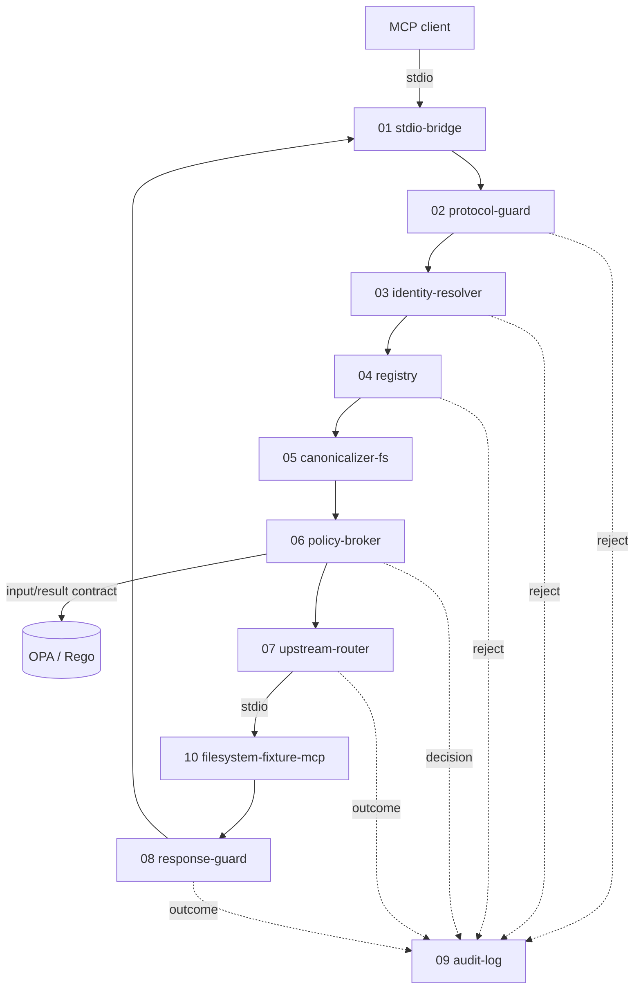

# Zero-Trust MCP Gateway — Build Plan

**Status:** v1 plan, supersedes the scope in `Zero_Trust_MCP_Gateway_Final.md`
**Date:** 2026-08-08
**Source document:** `Zero_Trust_MCP_Gateway_Final.md` — retained as the archival requirements catalogue. It is not edited; corrections are listed in §7 of this file, and this file wins on any conflict.
**Specs:** `_specs/` — one functional spec per service unit, no code, sufficient to write a tech sheet from.
**Tech sheets:** `_tech/` — implementation detail per spec, filenames mirrored. See [`_tech/README.md`](_tech/README.md).

---

## 1. What this document is

The source document is a 2,243-line requirements catalogue with ~150 normative requirements and five delivery phases. Its research is accurate and its architecture is sound. Its scope is a team-year.

This plan cuts it to a shippable v1, fixes the claims that were unfalsifiable or stale, names the one thing this gateway does that the incumbents do not, and orders the work so that every week produces a runnable artifact rather than more specification.

The governing rule for the rest of this project:

> **Spec-to-code ratio must fall from here, not rise.** No new requirement is written unless it is being implemented in the same week. The `_specs/` directory is closed for additions until v1 ships; it is only edited to correct what implementation proved wrong.

---

## 2. The differentiator

Every gateway in this category — Docker MCP Gateway, IBM ContextForge, Microsoft MCP Gateway, Lunar MCPX, MCPJungle, Solo.io agentgateway, Kong, Pomerium, Cloudflare AI Gateway — was designed against session-based Streamable HTTP. The MCP specification dated **2026-07-28** made the core protocol stateless and introduced request-level metadata headers (`Mcp-Method`, `Mcp-Name`) that mirror JSON-RPC body fields, with a specification rule that a disagreeing header and body **must be rejected**.

That mirroring is a new, unguarded attack surface: a policy engine that authorizes on the header while the upstream server executes the body — or vice versa — is exploitable by construction, and it did not exist before 2026-07-28.

**v1's claim, in one sentence:**

> A default-deny MCP enforcement point built natively against the 2026-07-28 stateless specification, which authorizes on a single canonical view of the request and rejects header/body disagreement before any routing or policy decision occurs.

This is a narrow and **time-limited** edge — incumbents will close it. That is fine: v1 is a portfolio and evidence artifact with a 6–8 week horizon, not a product with a moat. The edge is what makes the artifact worth reading in Q3/Q4 2026, and `_specs/02-svc-protocol-guard.md` is where it lives.

> **D-1 — RESOLVED 2026-08-08, see [ADR-001](_specs/ADR-001-transport-and-mirrored-metadata.md).** The spec is explicit that stdio has "no header layer", so the differentiator exists only on Streamable HTTP. **The client-facing edge is Streamable HTTP, loopback-bound; the upstream leg stays stdio.** This is cheaper than the plan assumed: the 2026-07-28 revision removed sessions, the GET stream, resumability, and the `initialize` handshake, leaving one POST endpoint. It also dissolves spike S-1, since an ASGI app hands over raw bytes and headers directly. The mirrored surface turned out to be four families, not two — including `Mcp-Param-{Name}` driven by server-supplied `x-mcp-header` schema annotations, a base64 sentinel encoding, and a spec-named downgrade attack against gateways specifically.

**What this is not:** not a startup, not entrant #20 in a commoditizing category. The market analysis in §9 records why.

---

## 3. Scope

### 3.1 v1 — ships in 6–8 weeks

| Included | Why |
|---|---|
| **Streamable HTTP client edge (loopback), stdio upstream leg** | The only transport carrying mirrored metadata ([ADR-001](_specs/ADR-001-transport-and-mirrored-metadata.md)); one POST endpoint, no TLS, no auth, no sessions |
| `tools/list` filtering, `tools/call` enforcement | The only MCP methods with a protected side effect in scope |
| JSON-RPC hardening + **header/body consistency across all four mirrored families** | The differentiator (§2) |
| Locally configured principal | Honest identity for `stdio`; no IdP required |
| Explicit server registry + tool schema fingerprint | Default-deny routing; drift detection |
| Filesystem path canonicalization | The one canonicalizer family that is provably testable on a laptop |
| OPA/Rego policy, fail-closed | Deterministic authorization, versioned |
| JSONL audit, one event per decision | The evidence artifact |
| Sandboxed synthetic filesystem fixture MCP server | The protected system |
| ≥100 deterministic tests + Hypothesis variants, zero model calls | The security result |
| Direct-vs-protected overhead measurement, published | The performance result |
| One benchmark report | The deliverable a hiring manager reads in five minutes |

### 3.2 v1.1 — weeks 7–10, only after v1's exit gate passes

| Included | Why deferred to here |
|---|---|
| PydanticAI agent + Groq `openai/gpt-oss-20b` | Proves the security core is model-independent; adds nothing to it |
| Local tool-calling only; provider-native MCP/search/exec disabled | Required for the isolation claim to hold |
| Provider response validation + per-run budgets | Cost and blast-radius control |
| 5 model-driven attack scenarios | Narrative for the report |

### 3.3 Cut from v1 and v1.1 — with the trigger that would bring each back

Recorded in full in `_specs/90-deferred-register.md`. Summary of the cuts and the reasoning:

| Cut | Reason |
|---|---|
| ~~Streamable HTTP transport~~ — **reinstated by [ADR-001](_specs/ADR-001-transport-and-mirrored-metadata.md)**. TLS, CORS, auth, sessions and resumability stay cut. | The mirrored metadata the differentiator depends on exists only on HTTP, and the 2026-07-28 revision stripped this transport down to a single POST endpoint. |
| OIDC/OAuth resource server, Keycloak | A static JWKS served from a locally minted keypair (authlib) yields identical assertions with no container. Keycloak is infrastructure theatre here. |
| Confused-deputy defense (`REQ-AUTH-006`) | Cannot be meaningfully tested without a real third-party IdP and a genuine second client. Untestable requirement = not a requirement. |
| Multi-tenancy (`REQ-SQL-006`, `REQ-REG-004`, cross-tenant tests) | There are no tenants. One laptop, synthetic fixtures. Building isolation for zero tenants is speculation. |
| SQL guardrails / SQLGlot AST | Second canonicalizer family. Genuinely valuable, genuinely a second project. Trigger: v1 shipped and a SQL fixture is the next portfolio piece. |
| Outbound HTTP / SSRF guardrails | Third canonicalizer family. Same reasoning. |
| Human approval tokens, approval UI | Real design work, but v1 has no R3 action to approve — the filesystem fixture is read/write on synthetic data. Trigger: a business-action fixture exists. |
| Admin control plane, RBAC, dashboard | Three UI surfaces in a project whose value is the enforcement core. The audit JSONL plus `jq` is the v1 admin interface. |
| Circuit breakers, backpressure, router isolation | Reliability engineering for a load profile that does not exist at one client, one upstream. |
| OTel collector, Grafana, 11 metrics, 10 span stages | v1 emits the four latency numbers the report needs, to JSONL. Instrumentation stays vendor-neutral at the code level so a collector can be added without a rewrite. |
| 4-model × 2-provider matrix as a *security* result | `REQ-MODEL-011` says no security claim may depend on model behavior — which means the matrix cannot produce a security result. It is a behavior study. Kept as such in the research track (§8), removed from the engineering deliverable. |
| Cloudflare fallback as a P1 deliverable with its own eval subset | Both providers are OpenAI-compatible; it is a base-URL swap. It is a config line in v1.1, not a phase. |
| Phase 5 entirely (tamper-evident audit, signed bundles, hardware keys, formal Rego analysis, k3s) | Honestly labelled "possible work" in the source, but its presence signals scope inflation. Formal policy analysis of Rego is a research topic, not a backlog item. |
| TOCTOU / symlink race testing as a primary control | See §7.4 — the control is the sandbox mount; canonicalization is defense in depth, and the plan now says so plainly instead of hiding behind "where practical". |

---

## 4. Implementation hierarchy

Eleven service units for v1, one for v1.1. Each has a spec in `_specs/`. They are separated along the request lifecycle so each has a single testable contract — not because they will be separately deployed. **v1 is one Python process plus an OPA process plus a child MCP server process.** "Service" here means a unit with an owned contract, not a container.

### 4.1 Request path



Every terminating edge writes exactly one audit event. A request that dies at `02` is as auditable as one that completes at `08`.

### 4.2 Build order and dependencies

Ordered so that each step is runnable and testable the day it lands. Nothing is built before the thing that consumes it can exercise it.

| # | Unit | Depends on | Runnable proof when done |
|---|---|---|---|
| 1 | `10-fixture-filesystem-mcp` | — | A real MCP server with synthetic fixtures; `direct` mode demonstrates unsafe side effects |
| 2 | `11-svc-eval-harness` (skeleton) | 10 | Scenario schema loads; `direct` mode runs; side-effect oracle observes real damage |
| 3 | `01-svc-stdio-bridge` | 10 | Client → gateway → fixture passthrough works, zero policy |
| 4 | `09-svc-audit-log` | — | Every passthrough writes one JSONL event |
| 5 | `02-svc-protocol-guard` | 01, 09 | Malformed JSON-RPC and header/body mismatch rejected + audited |
| 6 | `03-svc-identity-resolver` | 09 | Principal appears in the audit event, labelled `local_config` |
| 7 | `04-svc-registry` | 02, 09 | Unregistered server/tool denied; schema fingerprint recorded |
| 8 | `05-svc-canonicalizer-fs` | 04 | Traversal/encoding/symlink cases resolve to a canonical path or reject |
| 9 | `06-svc-policy-broker` | 03, 04, 05, 09 | OPA allow/deny with reason code; OPA killed → all protected calls denied |
| 10 | `07-svc-upstream-router` | 06, 10 | Only allowed calls reach the fixture; obligations enforced |
| 11 | `08-svc-response-guard` | 07 | Oversized/mismatched upstream responses become controlled errors |
| 12 | `11-svc-eval-harness` (full) | all | 100+ scenarios, `direct` vs `protected`, overhead numbers, report |
| 13 | `12-svc-agent-harness` | v1 exit gate | Groq proposes calls; gateway result is identical to the deterministic client's |

Order rationale: the fixture and the oracle come **first** so that "the gateway blocked it" is verified against observed filesystem state from day one, never against a denial message. The audit log comes before any enforcement so that no enforcement stage is ever written without its evidence path.

---

## 5. Milestones

Eight weeks, part-time. Each gate is a runnable artifact, not a document.

### Week 1 — Fixture, oracle, and the damage demo
**Build:** `10`, `11` (skeleton).
**Gate:** `direct` mode demonstrates ≥3 real unsafe side effects against synthetic fixtures — a confidential file read, a production config read, a traversal escape out of `public/` — each verified by the side-effect oracle reading actual filesystem state, not by a log line.
**Note:** this is the only "threat model" deliverable in v1. The source document's Phase 0 gate (threat model + ADRs + scenario schema + fixtures + Inspector + 25 cases) is replaced by: the fixture, the oracle, the scenario schema, and a one-page threat model that fits on one page. ADRs get written when a decision is actually contested.

### Week 2 — Transparent bridge + audit
**Build:** `01`, `09`.
**Gate:** an MCP client (test driver and MCP Inspector) completes `tools/list` and `tools/call` through the gateway with no policy, and every request produces exactly one JSONL audit event with a stable request ID that correlates to the fixture's observed operation.

### Weeks 3–4 — The differentiator + default-deny routing
**Build:** `02`, `03`, `04`.
**Gate:** header/body disagreement is rejected before routing, with a dedicated test class covering each mirrored field; malformed JSON-RPC boundary cases pass at, below, and above every configured limit; unregistered servers and tools are denied; a changed tool schema fingerprint quarantines the tool. Every rejection is audited.

### Week 5 — Canonicalization + policy
**Build:** `05`, `06`.
**Gate:** the filesystem attack class (plain traversal, encoded, double-encoded, null byte, absolute escape, symlink escape, case variants, separator variants) resolves correctly or rejects; OPA returns structured decisions with stable reason codes; **OPA process killed → every protected call denied, health endpoint still answers.**

### Week 6 — Forwarding, response guard, corpus to 100
**Build:** `07`, `08`; `11` to full.
**Gate:** no denied request reaches the fixture — verified by the oracle at the fixture side, not by the gateway's own claim; ≥100 deterministic scenarios pass, split malicious and legitimate; Hypothesis generates path/encoding/JSON variants from a recorded seed.

### Weeks 7–8 — Measure, write, ship
**Build:** benchmark run, report, README, one-page threat model.
**Gate:** the report in §6 exists, is reproducible from a commit SHA and a recorded seed, and publishes observed numbers including any that disappoint.

### v1 exit gate — all four must hold

1. Every malicious scenario in the corpus is denied **and** the side-effect oracle observes no prohibited state change at the fixture.
2. Every legitimate scenario produces the expected result. False positives are reported as a number, not asserted to be zero.
3. Every completed decision has exactly one audit event; audit completeness is measured, not assumed.
4. The security core passes with `GROQ_API_KEY` unset and no network.

Only after all four: start v1.1.

---

## 6. Verification plan

The source document made two claims that could not be falsified. Both are replaced.

### 6.1 Replacing "p95 ≤ 15 ms at 100 RPS"

The source's own §3.3.1 concedes the laptop is simultaneously client, gateway, policy engine, MCP server, and load generator. A latency gate measured under that co-location is mostly scheduling noise, and a *gate* on it invites tuning the measurement rather than the system.

**v1 does not gate on latency. v1 measures and publishes it.**

Method:
- Paired measurement, same scripted request, same process, alternating `direct` and `protected` — never two separate runs compared after the fact.
- Report **added overhead** as the paired difference distribution: p50, p95, p99, plus min and max.
- Report the four internal stages separately: protocol+canonicalization, OPA round trip, upstream, audit write. If OPA dominates, that is the finding.
- N ≥ 1,000 paired samples, single concurrency, then a second run at modest concurrency clearly labelled as a co-located development measurement.
- Publish the machine, OS, Python version, commit SHA, policy revision, and seed.
- Publish the number that comes out. If p95 is 40 ms, the report says 40 ms and explains where it went. A measured, explained 40 ms is a stronger portfolio signal than an unexplained 15 ms.

No model call is in any latency path. Model latency, when v1.1 exists, appears in a separate table and is never added to gateway numbers.

### 6.2 Replacing "zero authorization bypasses under the deterministic P0 corpus"

Circular: the same author writes the corpus and the enforcement. Unfalsifiable by construction.

Three changes make it a real claim:

1. **State the shape honestly.** The claim becomes: *"Across N scenarios in the published corpus, the side-effect oracle observed zero prohibited state changes at the protected system."* Scoped to a published, versioned corpus — not to the space of attacks.
2. **Add cases the author did not write.** Hypothesis generates path, encoding, identifier, numeric-boundary, and JSON-structure variants from a recorded seed. These are not hand-picked and can surprise the author. Report generated-case count and any failures separately from the hand-written corpus.
3. **Make it externally attackable.** The corpus, the fixture, and the policy bundle ship in the repo with a documented "add a scenario" path. An invitation to break it is what converts a self-graded exam into evidence. Any externally contributed failing case is recorded in the report with its fix.

Additionally: every "blocked" verdict is verified at the **fixture side** by the oracle. A denial message from the gateway is never sufficient evidence. This is the single most important methodological rule in the project and it is `_specs/11-svc-eval-harness.md`'s primary contract.

### 6.3 What v1 will not claim

- Not "secure against prompt injection" — v1 claims deterministic enforcement that is indifferent to prompt content.
- Not "production-ready" — one client, one upstream, one transport, synthetic data.
- Not a throughput or capacity number — co-located measurement only.
- Not that the model matrix proves anything about security (§8).

---

## 7. Corrections to the source document

The source is not edited; these override it.

### 7.1 Hetzner pricing (§3.6) — stale
Source lists CX23 4 GB at ~€5.99/mo and CX33 8 GB at ~€8.99/mo. Current pricing is approximately **€3.99–5.49** and **€6.49** respectively. Direction of the error is favourable, but the number is wrong. Treat all VPS and PaaS pricing in §3.4–3.7 as a snapshot requiring verification at purchase; do not cite it in the report without re-checking.

### 7.2 Performance gate (`REQ-REL-005`) — withdrawn
Replaced by the measurement protocol in §6.1. The 15 ms / 30 ms / 100 RPS targets are removed as gates.

### 7.3 Bypass claim (`REQ-REL-005`, `REQ-HARNESS-017`) — rewritten
Replaced by the scoped, corpus-published, Hypothesis-augmented claim in §6.2.

### 7.4 `REQ-FS-006` TOCTOU testing — reframed
Canonicalizing a path and then handing a string to a separate process is inherently racy; that race cannot be closed at the gateway. The source hid this behind "where practical". The plan states it plainly:

> **The primary filesystem control is the sandbox mount (`REQ-FS-004`).** Path canonicalization is defense in depth and a policy-input requirement, not a race-free guarantee. v1 tests canonicalization correctness thoroughly and does **not** claim TOCTOU safety.

This is a documentation fix, not a capability loss — and stating a limitation precisely is a stronger security-engineering signal than an unsupported claim.

### 7.5 Everything else verified
MCP 2026-07-28 stateless core, `Mcp-Method`/`Mcp-Name` and the reject-on-disagreement rule (SEP-2243), Groq `qwen/qwen3.6-27b`, the `llama-3.3-70b-versatile` shutdown on 2026-08-16, `gpt-oss-20b` at $0.075/$0.30 per M with 131,072 context, and Railway's $1/$5 tiers all check out against primary sources. Groq's own recommended replacements for the deprecated Llama models are `gpt-oss-120b` and `qwen3.6-27b` — the two the source picked independently. The research method was sound; only the scope was wrong.

---

## 8. Separate research track

The source fuses an engineering project with a research question. They have different outputs and different timelines, and fusing them damages both.

**Research question, stated on its own:**
> Does deterministic MCP enforcement hold uniformly across model families, and what does it cost in agent task completion?

This is genuinely under-studied. It is buried in `REQ-HARNESS-012` / `REQ-MODEL-011` and dressed as a security result, which it is not — `REQ-MODEL-011` correctly forbids any security claim from depending on model behavior, and that forbids the matrix from producing one. Running four models proves the gateway is deterministic, which one deterministic client already proved.

**Disposition:** the model matrix leaves the engineering deliverable entirely. It becomes a follow-on study, run only after v1 ships, whose dependent variable is **task completion and recovery behavior under denial** — not enforcement. Enforcement is the control, held constant and already proven.

Do not start this before v1's exit gate. It is not on the 8-week path.

---

## 9. Why this is a portfolio artifact, not a product

Recorded once so it is not re-litigated.

**The problem is real and documented.** 50% of MCP builders cite security/access control as their top challenge and 38% say it actively blocks adoption; 24–25% of public MCP servers have no authentication at all; 30+ CVEs landed in a single 60-day window in 2026, one at CVSS 9.8 and actively exploited; ~200,000 vulnerable MCP instances were exposed in one 2026 disclosure; 88% of organizations reported confirmed or suspected AI agent incidents. People are getting owned now.

**The category is crowded and commoditizing.** Open source: Docker MCP Gateway, IBM ContextForge, Microsoft MCP Gateway, Lunar MCPX, MCPJungle. Commercial: Solo.io agentgateway, Kong, Pomerium, Cloudflare AI Gateway, Zenity, Prompt Security. "10 Best MCP Gateways of 2026" listicles exist — reliable evidence of content-marketing saturation. Entrant #20 with no distribution and no enterprise relationships does not win this.

**The crowding is why the portfolio value is high.** A saturated category means the skill is being actively hired for. Security engineering, AI platform, and appsec teams recognize this problem instantly, and the artifacts v1 produces — a threat model, a deterministic attack corpus, a side-effect oracle, measured overhead, audit evidence — are exactly what separates a security engineer from someone who built a demo.

**Therefore:** optimize v1 for *legibility and evidence*, not for feature parity with ContextForge. A hiring manager must be able to read the report in five minutes and see a measured claim, a published corpus, and a stated limitation.

---

## 10. Spec index

Specs are functional requirements only — contracts, behaviors, failure modes, acceptance criteria. **No code.** Each is written so a tech sheet (interfaces, data shapes, library choices, module layout) can be derived from it without re-reading the source document.

| Unit | Spec (what + proof) | Tech (how) | Phase |
|---|---|---|---|
| Shared vocabulary, risk tiers, audit registry | [spec](_specs/00-conventions.md) | [tech](_tech/00-conventions.md) | v1 |
| Transport edge and upstream process supervision | [spec](_specs/01-svc-stdio-bridge.md) | [tech](_tech/01-svc-stdio-bridge.md) | v1 |
| JSON-RPC hardening + header/body consistency (**differentiator**) | [spec](_specs/02-svc-protocol-guard.md) | [tech](_tech/02-svc-protocol-guard.md) | v1 |
| Locally configured principal and authorization context | [spec](_specs/03-svc-identity-resolver.md) | [tech](_tech/03-svc-identity-resolver.md) | v1 |
| Approved servers, tools, schema fingerprints, drift | [spec](_specs/04-svc-registry.md) | [tech](_tech/04-svc-registry.md) | v1 |
| Filesystem path canonicalization | [spec](_specs/05-svc-canonicalizer-fs.md) | [tech](_tech/05-svc-canonicalizer-fs.md) | v1 |
| OPA integration, input/result contract, fail-closed | [spec](_specs/06-svc-policy-broker.md) | [tech](_tech/06-svc-policy-broker.md) | v1 |
| Obligation enforcement and forwarding | [spec](_specs/07-svc-upstream-router.md) | [tech](_tech/07-svc-upstream-router.md) | v1 |
| Upstream response validation and bounding | [spec](_specs/08-svc-response-guard.md) | [tech](_tech/08-svc-response-guard.md) | v1 |
| JSONL audit events and redaction | [spec](_specs/09-svc-audit-log.md) | [tech](_tech/09-svc-audit-log.md) | v1 |
| Sandboxed synthetic protected system | [spec](_specs/10-fixture-filesystem-mcp.md) | [tech](_tech/10-fixture-filesystem-mcp.md) | v1 |
| Corpus, side-effect oracle, modes, benchmark | [spec](_specs/11-svc-eval-harness.md) | [tech](_tech/11-svc-eval-harness.md) | v1 |
| PydanticAI + Groq, tool-call validation, budgets | [spec](_specs/12-svc-agent-harness.md) | [tech](_tech/12-svc-agent-harness.md) | v1.1 |
| Everything cut, with the trigger that revives it | [spec](_specs/90-deferred-register.md) | — | — |

**Division of labour:** `_specs/` says what must be true and how it is proven; `_tech/` says how to build it. On conflict, the spec wins.

---

## 11. Repository layout

Flattened from the source's §3.10 to match what v1 actually builds. Directories appear when they hold something.

```text
zero-trust-mcp-gateway/
  PLAN.md
  README.md                 # the five-minute read: claim, method, numbers, limits
  pyproject.toml / uv.lock
  .env.example
  _specs/
  docs/
    threat-model.md         # one page
    benchmark-report.md     # the deliverable
    adr/                    # only for contested decisions
  gateway/
    bridge.py               # 01
    protocol.py             # 02
    identity.py             # 03
    registry.py             # 04
    canonicalize/fs.py      # 05
    policy.py               # 06
    router.py               # 07
    response.py             # 08
    audit.py                # 09
  policies/
    rego/ tests/
  fixtures/
    filesystem/             # 10 — synthetic only, mounted read-scoped
  harness/
    scenarios/ oracles/ report.py   # 11
  tests/
    unit/ protocol/ security/ property/
  .github/workflows/
```

`agent/` appears in v1.1. `deploy/`, `dashboards/`, `servers/sql_fixture/`, `servers/enterprise_fixture/` do not appear until their trigger in `_specs/90-deferred-register.md` fires.

---

## 12. Cost

| Item | v1 | v1.1 |
|---|---|---|
| All local software | $0 (open source) | $0 |
| Inference | $0 — no model calls in v1 | $0 within Groq free quota; ~$0.54 per 1,000 scenarios if exceeded |
| Hosting | none — nothing is deployed | none |
| **Total** | **$0** | **$0–5/month** |

VPS and PaaS pricing is out of scope for v1 and must be re-verified before any deployment (§7.1).

---

## 13. Standing rules

1. No requirement is written that is not implemented the same week.
2. No "blocked" verdict is accepted from the gateway's own output — the oracle verifies at the protected system.
3. No security claim depends on a model's behavior.
4. Every reported number carries its environment, commit SHA, policy revision, and seed.
5. A limitation stated precisely beats a capability claimed loosely.
6. `_specs/` is closed for additions until v1 ships.
